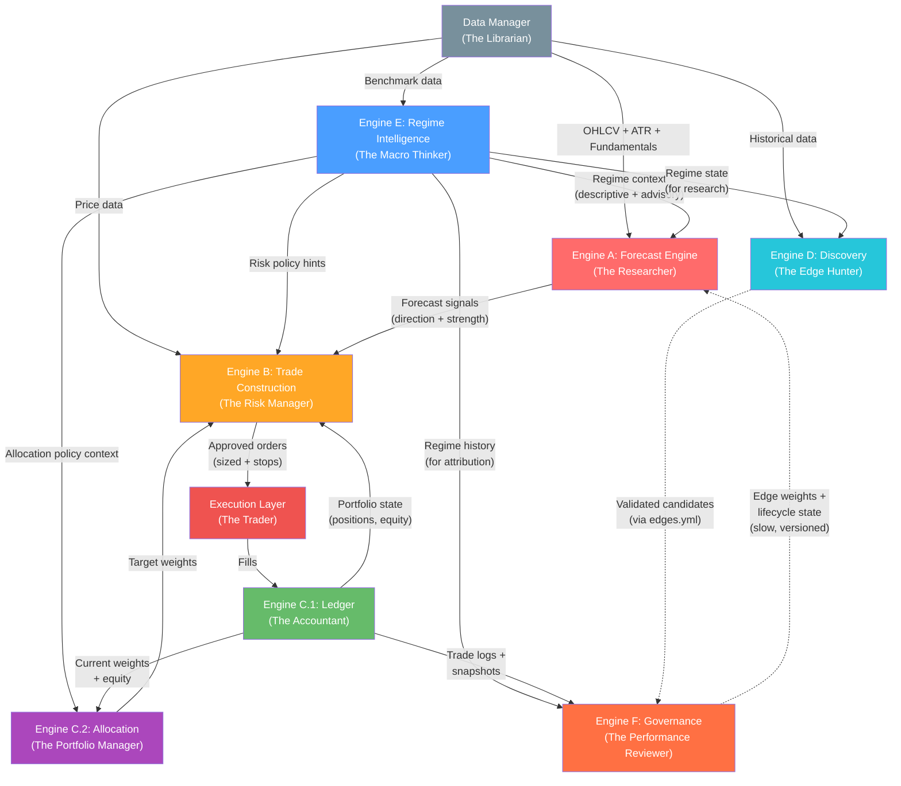

# Formal Engine Charters (A → F)
### *The Institutional Blueprint — From "Smart Modules" to "Governed Institutions"*

> **Design Principle:** *"The best-performing market organizations are usually not the ones with the smartest single thinker. They are the ones with the best division of cognitive labor."*
>
> Each engine maps to a real market professional. They don't vote on the same decision — they act where they are strongest, in sequence, with clear authority.

---

## How the Team Maps to Our Engines

| Role (Human Room) | Engine | Core Question |
|---|---|---|
| Researcher / Quant | **A — Forecast Engine** | *What should work, and how strongly?* |
| Macro / Regime Thinker | **E — Regime Intelligence** | *What kind of market are we in?* |
| Risk Manager | **B — Trade Construction** | *What could kill us, and how do we survive?* |
| Portfolio Manager / Allocator | **C — State & Allocation** | *Where should capital actually go?* |
| Edge Hunter / Evolutionary Researcher | **D — Discovery & Evolution** | *What new edges exist, and are they real?* |
| Performance Reviewer / Governor | **F — Governance** | *What has earned trust over time?* |
| Operations / Accounting | **C (Ledger Layer)** | *What is the actual state of the book?* |
| Trader / Execution | **B + Execution Simulator** | *How do we express this efficiently?* |

> [!IMPORTANT]
> The system has **8 conceptual roles mapped across 6 engines.** Engine C bundles two fundamentally different people (the PM and the Accountant) with a hard internal wall. Discovery (D) and Governance (F) split what was previously a single overloaded engine — D hunts for new edges offline, F manages the lifecycle and weights of edges that are already in production.

---

## Engine A — Forecast Engine (The Researcher)

### Mission
Produce calibrated directional forecasts with conviction strength from standardized market data and edge outputs.

### Allowed Inputs
- OHLCV price data (via Data Manager)
- Edge module outputs (raw scores from all registered sub-strategies)
- Regime context from Engine E (consumed as features, not as hard overrides — passed by ModeController)
- Fundamental data (P/E, etc. from Data Manager)
- Edge weights from Engine F (applied during ensemble aggregation)

### Forbidden Inputs
- Current cash balance or portfolio state
- Current position sizes or qty
- Broker/execution state (fill prices, slippage)
- Current realized PnL
- Portfolio exposure levels
- Sector concentration data

### Output Contract
```python
{
    "ticker": str,
    "side": "long" | "short" | "none",
    "strength": float,        # [0.0, 1.0] — calibrated conviction
    "decomposition": {        # Explainability artifact
        "edge_contributions": {"rsi_bounce_v1": 0.3, "momentum_v1": 0.5, ...},
        "regime_adjustment": float,    # how much E's context shifted the forecast
        "ensemble_method": str,
    },
    "meta": {"market_state": {...}, "edge_count": int}
}
```

### Invariants
1. Same inputs **always** produce the same signal (deterministic)
2. Score lies in bounded range `[0.0, 1.0]`
3. Stronger scores correspond to stronger expected outcomes *on average*
4. **No portfolio state is needed to form the score**
5. **No broker/execution state affects forecast generation**
6. Every final score can be decomposed into edge contributions + adjustments

### Design Notes

| Topic | Ruling |
|---|---|
| Macro-regime gating | A consumes E's regime as a *predictive feature* (bear markets predict lower returns), not a hard override. Safety-oriented gating belongs in B. |
| ML Gate (SignalGate) | Lives in `engine_a_alpha/learning/`. Only kept if trained on orthogonal features. If correlated with existing edges, remove. |
| Governance edge weights | F publishes `edge_weights.json`. A consumes them during ensemble aggregation but logs the decomposition showing F's influence. A is not *controlled* by F silently. |
| Flip cooldown | Belongs in B — this is execution/churn control, not forecasting. |
| Ticker-level vol/trend penalty | Legitimate forecast conditioning. Use E's ticker-level context where possible. |

### Verification Tests
- **Monotonicity test:** Bucket all historical signals by strength quintile. Do higher-conviction signals produce higher average forward returns?
- **Edge decomposition test:** Can every signal be explained as a weighted sum of edge contributions?
- **Portfolio independence test:** Does changing portfolio cash or positions change A's output? (Must be NO)
- **Regime conditioning test:** Does A improve when E's context is added vs. removed?

### Philosophy: A Should Be Loose
A's job is to be the Researcher — it should report what it sees, not pre-filter based on fear. A should be **opinionated about direction** but **not protective about risk.** Let it say "I strongly believe TSLA is a long" even in a bear market. It's B's job to say "I hear you, but I'm only allowing 0.5% exposure right now."

---

## Engine E — Regime Intelligence (The Macro Thinker)

### Mission
Detect, score, and publish the current multi-axis market environment as an official, system-wide context object with non-binding advisory policy hints.

### Allowed Inputs
- Broad market benchmark data (SPY, QQQ, VIX, etc.)
- Market breadth indicators (advance/decline, new highs/lows)
- Cross-asset correlation data
- Volatility surfaces / term structure
- Macro indicators (yield curve, credit spreads — future)

### Forbidden Inputs
- Individual ticker alpha scores
- Portfolio state (positions, cash, PnL)
- Edge performance metrics (that's F's job)
- Execution state

### Output Contract
```python
{
    "timestamp": str,
    "trend_regime":      {"state": "bull"|"bear"|"range"|"transition", "confidence": float},
    "volatility_regime":  {"state": "low"|"normal"|"high"|"shock",     "confidence": float},
    "correlation_regime": {"state": "dispersed"|"normal"|"elevated"|"spike", "confidence": float},
    "breadth_regime":     {"state": "strong"|"narrow"|"weak"|"deteriorating", "confidence": float},
    "transition_risk": float,    # probability of regime change
    "regime_stability": float,   # how confident we are this regime persists
    "advisory": {                # NON-BINDING hints — downstream engines retain full authority
        "suggested_exposure_cap": float,          # e.g., 0.6 in high vol
        "risk_scalar": float,                     # multiplier for position sizing
        "edge_affinity": {                        # which edge styles suit this regime
            "momentum": float,                    # >1.0 = favorable, <1.0 = unfavorable
            "mean_reversion": float,
            "trend_following": float,
            "fundamental": float,
        },
        "caution_note": str,                      # human-readable advisory
    },
    "explanation": {...}
}
```

### Invariants
1. E **never** directly places, sizes, or vetoes a trade
2. E **never** mutates portfolio state
3. E is the **single official source** of regime truth — no other engine independently classifies macro regime
4. Regime transitions require hysteresis (no single-bar flips)
5. Every classification has an associated confidence score
6. E is **descriptive + advisory** — it describes the weather and suggests what to wear, but each engine dresses itself
7. Advisory hints are explicitly non-binding — each downstream engine retains full authority over its own decisions

### Orchestration
ModeController calls `RegimeDetector.detect_regime()` once per bar and passes the regime state object to A, B, and F as a parameter. Engines do not import RegimeDetector directly (reduces coupling). D (Discovery) may import RegimeDetector directly for offline research use.

### Interaction Rules
- **A consumes E** as predictive features for forecast conditioning (via `regime_meta` parameter)
- **B consumes E** for dynamic risk policy (e.g., widen stops in high vol, tighter exposure caps)
- **C.2 consumes E** for allocation policy tuning (e.g., lower exposure in risk-off)
- **D consumes E** for regime-aware research (which edges work in which regimes)
- **F consumes E** for regime-aware attribution (was this edge bad, or just out of phase?)

> [!WARNING]
> **Double-counting risk:** If A reduces conviction in bear regime AND B reduces size in bear regime AND C reduces exposure in bear regime, the same fact gets counted 3x. Each engine must document exactly which E fields it uses and why, to prevent overlap. See the Double-Counting Prevention Matrix below.

---

## Engine B — Trade Construction (The Risk Manager)

### Mission
Transform approved forecast intents into executable, policy-compliant trade proposals with explicit risk boundaries.

### Allowed Inputs
- Signal from Engine A (direction + strength)
- Regime context from Engine E (for dynamic risk policy — passed by ModeController)
- Portfolio state from Engine C's Ledger Layer (current positions, equity, exposure, available capital)
- Historical price data with ATR (from Data Manager)
- Sector map (from config)

### Forbidden Inputs
- Edge performance metrics (that's F's domain)
- Edge weight multipliers (that flows A → F, not through B)
- Raw edge scores (B sees only A's finalized signal)

### Output Contract
```python
{
    "ticker": str,
    "side": "long" | "short" | "exit",
    "qty": int,
    "stop": float,
    "take_profit": float,
    "meta": {
        "sizing_mode": str,           # "atr_risk" | "target_weight" | etc.
        "risk_budget": float,
        "binding_constraint": str,     # what constraint was the limiter
        "rejection_reason": str|None,  # if rejected, why exactly
        "regime_adjustments": {...},   # what E's context changed
    },
    "audit": {                         # decision audit object
        "requested_qty": int,
        "clipped_qty": int,
        "clip_reason": str|None,
        "projected_portfolio_impact": {
            "gross_exposure_after": float,
            "sector_exposure_after": float,
        }
    }
}
```

### Invariants
1. No accepted trade violates hard exposure rules
2. No accepted trade exceeds liquidity (ADV) caps
3. Every accepted trade has explicit risk metadata (stop, TP, sizing rationale)
4. **Every rejected trade has an auditable rejection reason**
5. Same signal + same portfolio state + same market state = same decision (deterministic)
6. B is **mechanical and boring** — fixed risk budget, volatility scaling, hard caps

### Design Notes

| Topic | Ruling |
|---|---|
| AI Confidence scaling position size | **Remove** — This makes B a second alpha engine. If higher confidence should mean larger size, that should be expressed through A's strength value, not B's internal scaling. |
| Regime-based stop widening | **Keep** — Legitimate risk policy. B consumes E's vol regime to adapt protective structure. Source regime from E, not internal logic. |
| Flip cooldown enforcement | **Absorb from A** — Cooldown is churn control, which is an execution concern. |

---

## Engine C — State & Allocation (The Accountant + PM)

### Mission
Maintain official portfolio truth (Ledger Layer) and compute policy-driven target holdings (Allocation Layer).

> [!IMPORTANT]
> **C has two internal layers with a hard wall between them.**

### C.1 — Ledger Layer (The Accountant / Controller)

#### Sub-Mission
Maintain the irrefutable, deterministic source of truth for all accounting state.

#### Owns
- Cash balance
- Position quantities and cost basis
- Realized / Unrealized PnL
- Fill processing (partials, reversals, commissions)
- Equity computation
- Snapshot history

#### Invariants (Ledger)
- `Equity = Cash + Σ(qty × price)` — **always holds**
- Cash changes reconcile exactly to fills and fees
- Position quantities reconcile exactly
- Realized PnL is path-correct (FIFO)
- Fills are **never** silently dropped

### C.2 — Allocation Layer (The Portfolio Manager)

#### Sub-Mission
Determine the theoretical target allocation across assets using declared portfolio policy.

#### Owns
- Target weight computation (Inverse-Vol, MVO, or fixed allocations)
- Portfolio-level vol targeting (scale weights to match `target_volatility` via `w @ cov @ w`)
- Advisory exposure cap enforcement (scale weights when gross exceeds Engine E's `suggested_exposure_cap`)
- Regime-specific config overrides (load per-regime allocation recommendations from `AllocationEvaluator`)
- Drift measurement vs. target state
- Rebalance trigger decisions
- Diversification and correlation-aware weighting
- Autonomous allocation discovery (via `AllocationEvaluator`, orchestrated by Governor)

#### Allowed Inputs (Allocation Layer only)
- Signals from Engine A (as expected return proxies for MVO)
- Regime context from Engine E (for allocation policy tuning, exposure caps, regime-specific config)
- Covariance / correlation data (from Data Manager)
- Current portfolio weights from Ledger Layer
- Allocation recommendations from Governor (via `data/research/allocation_recommendations.json`)

#### Invariants (Allocation)
- Target weights are bounded (per-asset caps, potentially regime-adjusted)
- Vol targeting scalar is clamped (0.3-2.0x) to prevent extreme scaling
- Targets are explainable by declared policy + regime overrides
- Rebalance only triggers when drift exceeds threshold
- Small changes in inputs do not create absurd weight instability
- Regime config overrides always reset to base config before applying (no state leakage across bars)

### Shadow Book Concept
C's Ledger must never be contaminated by hypothetical portfolios. Shadow/model portfolio testing should live in D's research domain or a dedicated simulation harness. The Ledger Layer manages only the real book.

---

## Engine D — Discovery & Evolution (The Edge Hunter)

### Mission
Hunt for new trading edges, validate candidates through rigorous walk-forward testing, research edge combinations, and output validated candidates for Governance to evaluate and activate.

### Allowed Inputs
- Historical OHLCV data (from Data Manager)
- Feature sets (40+ features across 7 categories — computed by `feature_engineering.py`)
- Regime state from Engine E (for regime-aware research and feature engineering)
- Existing edge configurations and composite genomes (from `edges.yml` and `ga_population.yml`)
- SPY/TLT/GLD data for inter-market feature computation

### Forbidden Inputs
- Live portfolio state (positions, cash, PnL) — D operates offline on historical data
- Live trade execution or order generation
- Edge weight management or lifecycle decisions (that's F's job)
- Real-time price data for trading decisions

### Output Contract
```python
# D writes to edges.yml — new candidate entries, promotes to active only if ALL gates pass
{
    "edge_id": str,
    "status": "candidate" | "active" | "failed",
    "module": str,                   # e.g., "engines.engine_a_alpha.edges.composite_edge"
    "class": str,                    # e.g., "CompositeEdge"
    "category": str,                 # "evolutionary" | "discovered_rule" | edge-specific
    "params": {
        "genes": [...],              # for CompositeEdge genomes
        "direction": "long" | "short" | "market_neutral",
        "validation_sharpe": float,  # stored for GA fitness tracking
    },
    "version": str,                  # e.g., "1.0.0-gen3"
    "origin": "genetic_algorithm" | "tree_scanner" | "discovery_engine",
}

# Validation result (internal, stored in params for fitness tracking)
{
    "sharpe": float,                 # Gate 1: must be > 0
    "robustness_survival": float,    # Gate 2: PBO 50 paths, must be > 0.7
    "wfo_degradation": float,        # Gate 3: OOS/IS ratio, must be >= 0.6
    "significance_p": float,         # Gate 4: Monte Carlo p-value, must be < 0.05
    "passed_all_gates": bool,
}
```

### Invariants
1. D auto-promotes candidates to `active` only when ALL 4 validation gates pass — otherwise marks as `failed`
2. D **never** modifies `edge_weights.json` — that's F's exclusive domain
3. D **never** places, sizes, or executes trades during live operation
4. Every candidate must pass 4-gate validation (backtest → PBO → WFO → significance) before promotion
5. D's research is fully reproducible given the same data and random seeds
6. D can be **completely disabled** without affecting the live trading pipeline (A, B, C, E, F)
7. GA population state survives across discovery cycles via `ga_population.yml`

### Modules

| Module | Class | Purpose |
|---|---|---|
| `discovery.py` | `DiscoveryEngine` | Orchestrates hunt, GA evolution, validation, promotion |
| `tree_scanner.py` | `DecisionTreeScanner` | Two-stage ML: LightGBM screening + decision tree rule extraction |
| `feature_engineering.py` | `FeatureEngineer` | 40+ features across 7 categories (technical, fundamental, calendar, microstructure, inter-market, regime, cross-sectional) |
| `genetic_algorithm.py` | `GeneticAlgorithm` | Tournament selection, crossover, mutation, elitism with persistent population |
| `significance.py` | `monte_carlo_permutation_test`, `minimum_track_record_length` | Statistical significance testing (Monte Carlo + MinTRL) |
| `robustness.py` | `RobustnessTester` | PBO (Probability of Backtest Overfitting) testing — 50 synthetic paths |
| `wfo.py` | `WalkForwardOptimizer` | Walk-forward optimization, OOS/IS degradation ratio |
| `discovery_logger.py` | `DiscoveryLogger` | JSONL audit logging of all discovery activity |
| `synthetic_market.py` | `SyntheticMarketGenerator` | Regime-switching synthetic data for stress testing |

### Design Notes
- D receives regime context via `hunt(data_map, regime_meta=...)` — regime is computed by `run_backtest.py` from Engine E before calling hunt
- GA gene vocabulary spans 7 types (technical, fundamental, regime, calendar, microstructure, intermarket, behavioral) allowing cross-category composite edges
- D uses `MetricsEngine` from `core/` for computing performance metrics on candidate edges
- Inter-market features gracefully degrade when TLT/GLD are not in the backtest universe

---

## Engine F — Governance (The Performance Reviewer)

### Mission
Evaluate edge quality through time, manage the lifecycle of all edges (candidate → active → paused → retired), and adapt the system's trust map under explicit evidence rules with strong hysteresis.

### Allowed Inputs
- Trade logs with edge attribution (from C's Ledger)
- Portfolio snapshot history (from C's Ledger)
- Regime history (from E) — **critical for regime-aware attribution**
- Edge configuration metadata
- Validated candidate specs (from D via `edges.yml`)

### Forbidden Inputs
- Real-time price data (F operates on settled history, not live ticks)
- Direct portfolio state mutation
- Direct order generation or execution
- Edge discovery, parameter optimization, or walk-forward testing (that's D's job)

### Output Contract
```python
{
    "timestamp": str,
    "edge_scorecards": {
        "rsi_bounce_v1": {
            "trade_count": int,
            "win_rate": float,
            "sharpe": float,
            "sortino": float,
            "max_drawdown": float,
            "total_pnl": float,
            "expectancy": float,     # (win_rate × avg_win) - ((1-win_rate) × avg_loss)
            "regime_performance": {   # regime-conditioned metrics (via RegimePerfAnalytics)
                "bull_low_vol":  {"sharpe": float, "win_rate": float},
                "bear_high_vol": {"sharpe": float, "win_rate": float},
            },
            "confidence_in_assessment": float,   # how much data backs this
            "recommendation": "maintain" | "promote" | "demote" | "probation",
        },
        ...
    },
    "weight_updates": {
        "rsi_bounce_v1": {"old": float, "new": float, "reason": str},
        ...
    },
    "lifecycle_changes": {
        "new_candidate_v3": {"old_status": "candidate", "new_status": "active", "reason": str},
        ...
    },
    "system_state": {...}   # published for dashboards
}
```

### `edges.yml` Write Contract
D and F both write to `edges.yml` with explicit ownership:
- **D writes**: New entries (candidate specs, params, metadata, source info, validation results)
- **F writes**: `status` field changes (candidate → active → paused → retired), weight assignments
- Neither engine deletes the other's fields

### Invariants
1. F **never** changes live state without a versioned audit trail
2. Weight updates require **minimum evidence thresholds** (e.g., ≥50 trades, ≥30 days)
3. Maximum weight change per cycle is capped (e.g., ±15%)
4. Edge demotions require **statistically significant** underperformance, not just a bad streak
5. F can be **completely disabled** without breaking A, B, C, D, or E
6. F distinguishes "edge is broken" from "edge is out of regime phase" using E's history
7. F is fully autonomous — no human-in-the-loop required for weight adjustments or lifecycle transitions

### Modules

| Module | Class | Purpose |
|---|---|---|
| `governor.py` | `StrategyGovernor` + `GovernorConfig` | Edge weight management, EMA-smoothed scoring, regime-conditional weights, allocation evaluation orchestration |
| `regime_tracker.py` | `RegimePerformanceTracker` + `RegimeEdgeStats` | Per-edge, per-regime Welford online stats, learned affinity computation |
| `evaluator.py` | `EdgeEvaluator` + `EvaluatorConfig` | Research result ranking, time-decay scoring |
| `system_governor.py` | `SystemGovernor` | Master orchestrator (watch mode, state persistence) |
| `regime_analytics.py` | `RegimePerfAnalytics` | Conditional edge performance by regime |
| `promote.py` | — | Lifecycle promotion: candidate → active in edge_config.json |
| `evolution_controller.py` | `EvolutionController` | Coordinates evolution cycles with lifecycle management |

### Design Notes

| Topic | Ruling |
|---|---|
| Autonomous reweighing | F publishes weight *updates* with hysteresis. Changes are slow, capped (±15% per cycle), and require minimum evidence (≥50 trades). |
| Regime-conditional weights | F tracks per-edge, per-regime stats via `RegimePerformanceTracker` (Welford online algorithm). Returns blended weights when regime data sufficient, global weights otherwise. Persisted to `data/governor/regime_edge_performance.json`. |
| Learned edge affinity | F computes per-category affinity via `get_learned_affinity(regime_label)` — replaces static `MACRO_EDGE_AFFINITY`. Injected into `regime_meta["advisory"]["learned_edge_affinity"]` for consumption by SignalProcessor. |
| Allocation evaluation | F orchestrates `AllocationEvaluator` during `update_from_trade_log()` — tests 384 parameter combos, saves per-regime recommendations. `auto_apply_allocation` defaults to false (evaluate-only). |
| Win Rate as governance metric | Dangerous alone (low-WR trend systems can be excellent). Must be paired with Expectancy and Payoff Ratio. Primary metric: `expectancy = (win_rate × avg_win) - ((1-win_rate) × avg_loss)` |
| Weight-map versioning | Every weight update is timestamped and versioned. A must log which weight-map version it used for each signal generation (`weight_map_version` field). |
| Kill-switch | Edges exceeding MDD threshold (-25%) are immediately paused. This is a safety mechanism, not a performance judgment. |
| State publishing | F publishes `system_state.json` for dashboards. Conceptually a monitoring utility, but acceptable in F for now. |

### Verification Tests
- **Hysteresis test:** Inject a temporary 5-day drawdown followed by recovery. Does F overreact and demote, or does hysteresis prevent premature judgment?
- **Minimum evidence test:** Does F refuse to change weights for edges with <50 trades?
- **Regime attribution test:** Does F correctly distinguish "edge is broken globally" from "edge is out of phase with current regime"?
- **Kill-switch test:** Does F immediately pause an edge that hits -25% MDD?
- **Audit trail test:** Can every weight change be traced to specific evidence and timestamps?

---

## Engine Interaction Map



### Data Flow Summary

**Runtime Loop (every bar):**
1. **Data Manager** feeds raw market data to all engines
2. **ModeController** calls **Engine E** → publishes regime state (incl. advisory + learned affinity from F)
3. **ModeController** passes regime to **Engine A** → applies regime-conditional edge weights + learned affinity → emits forecast signals
4. **Engine C.2 (Allocation)** reads A's signals + E's context → computes target weights with vol targeting + exposure cap
5. **Engine B** reads A's signal + C.2's targets + C.1's state + E's regime-adaptive constraints → emits approved orders
6. **Execution Layer** processes orders → produces fills (each stamped with `regime_label`)
7. **Engine C.1 (Ledger)** processes fills → updates truth

**Slow Loops (periodic, not every bar):**
8. **Engine F** reads C.1's historical logs (with regime_labels) + E's regime history → updates `RegimePerformanceTracker` → publishes regime-conditional edge weights + learned affinity → runs `AllocationEvaluator` → consumed by A and C.2 on next cycle
9. **Engine D** runs offline research cycles → writes validated candidates to `edges.yml` → F evaluates and promotes/rejects

### Authority Boundaries (Who Controls What)

| Decision | Owner | Others Cannot |
|---|---|---|
| What direction to bet | A | B, C, D, E, F cannot overrule forecast direction |
| What regime we're in | E | A, B, C, D, F cannot independently classify macro regime |
| Whether a trade is safe | B | A, C, D, E, F cannot approve/reject orders |
| What the book actually is | C.1 | No engine can bypass fill processing |
| Where capital should go | C.2 | A, B, D, F cannot set allocation targets |
| What new edges might exist | D | A, B, C, E, F cannot hunt for or generate new edges |
| Which edges deserve trust | F | A, B, C, D, E cannot promote/demote/reweigh edges |

---

## Double-Counting Prevention Matrix

> [!CAUTION]
> The biggest cross-engine risk is the same market fact being penalized in multiple engines simultaneously. This matrix defines exactly how each engine is allowed to use regime information.

| Regime Signal | E publishes | A uses as... | B uses as... | C.2 uses as... | F uses as... |
|---|---|---|---|---|---|
| Bear Trend | `trend_regime.state = "bear"` | Feature for return prediction (shifts forecast downward for trend-following edges) | — | — | Attribution context + regime-conditional edge weights |
| High Volatility | `volatility_regime.state = "high"` | — | Wider stops, tighter ADV limits | — | Attribution context + regime-conditional edge weights |
| Elevated Correlation | `correlation_regime.state = "elevated"` | — | Lower gross exposure cap, tighter sector limits (20%) | Reduce diversification benefit assumptions in MVO | Attribution context |
| Risk-Off | `advisory.risk_scalar < 1.0` | — | Apply risk scalar to position sizing | — | — |
| Exposure Cap | `advisory.suggested_exposure_cap` | — | Dynamic max gross exposure | Scale weights when gross > cap | — |
| Max Positions | `advisory.suggested_max_positions` | — | Dynamic max positions cap | — | — |
| Learned Affinity | `advisory.learned_edge_affinity` | Apply per-category multiplier (0.3-1.5x) in SignalProcessor | — | — | Computed by RegimePerformanceTracker |
| Dispersed Correlation | `correlation_regime = "dispersed"` | — | Relaxed sector limits (40%) | — | — |

**Rule:** Each regime fact should affect **at most 2 engines**, and only through different mechanisms (A as a predictive feature, B as a risk constraint — never both as "reduce aggressiveness").

> **Note on Engine D:** Discovery consumes regime data for *research* (e.g., "which edges work best in bear markets?") but does not use regime to modify live trading behavior. D is an offline engine and is therefore excluded from the double-counting matrix.
