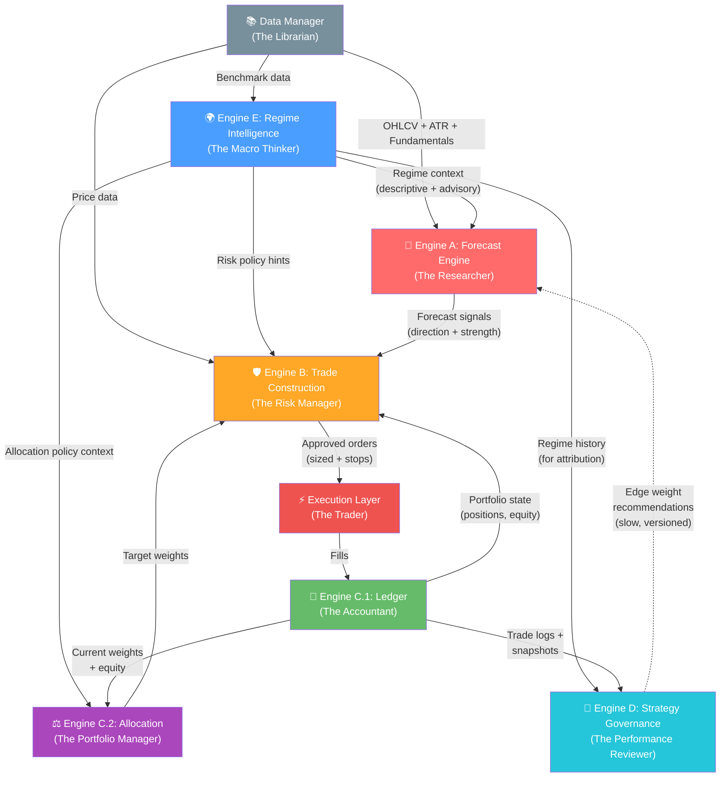

# Formal Engine Charters (A → E)
### *The Institutional Blueprint — From "Smart Modules" to "Governed Institutions"*

> **Design Principle (from Response 4):** *"The best-performing market organizations are usually not the ones with the smartest single thinker. They are the ones with the best division of cognitive labor."*
> 
> Each engine maps to a real market professional. They don't vote on the same decision — they act where they are strongest, in sequence, with clear authority.

---

## How Response 4's Team Maps to Our Engines

| Role (Human Room) | Engine | Core Question |
|---|---|---|
| Researcher / Quant | **A — Forecast Engine** | *What should work, and how strongly?* |
| Macro / Regime Thinker | **E — Regime Intelligence** | *What kind of market are we in?* |
| Risk Manager | **B — Trade Construction** | *What could kill us, and how do we survive?* |
| Portfolio Manager / Allocator | **C — State & Allocation** | *Where should capital actually go?* |
| Performance Reviewer / Governor | **D — Strategy Governance** | *What has earned trust over time?* |
| Operations / Accounting | **C (Ledger Layer)** | *What is the actual state of the book?* |
| Trader / Execution | **B + Execution Simulator** | *How do we express this efficiently?* |

> [!IMPORTANT]
> Response 4's strongest insight: **the team has 7 roles, not 4.** Our current Engine C bundles two fundamentally different people (the PM and the Accountant). That internal separation is critical.

---

## Engine A — Forecast Engine (The Researcher)

### Mission
Produce calibrated directional forecasts with conviction strength from standardized market data and edge outputs.

### Allowed Inputs
- OHLCV price data (via Data Manager)
- Edge module outputs (raw scores from all registered sub-strategies)
- Regime context from Engine E (consumed as features, not as hard overrides)
- Fundamental data (P/E, etc. from Data Manager)

### Forbidden Inputs
- ❌ Current cash balance or portfolio state
- ❌ Current position sizes or qty
- ❌ Broker/execution state (fill prices, slippage)
- ❌ Current realized PnL
- ❌ Portfolio exposure levels
- ❌ Sector concentration data

### Output Contract
```python
{
    "ticker": str,
    "side": "long" | "short" | "none",
    "strength": float,        # [0.0, 1.0] — calibrated conviction
    "decomposition": {        # NEW: explainability artifact
        "edge_contributions": {"rsi_bounce_v1": 0.3, "momentum_v1": 0.5, ...},
        "regime_adjustment": float,    # how much E's context shifted the forecast
        "ensemble_method": str,
    },
    "meta": {"market_state": {...}, "edge_count": int}
}
```

### Invariants
1. Same inputs **always** produce the same signal (deterministic)
2. Score lies in bounded range `[0.0, 1.0]`
3. Stronger scores correspond to stronger expected outcomes *on average*
4. **No portfolio state is needed to form the score**
5. **No broker/execution state affects forecast generation**
6. Every final score can be decomposed into edge contributions + adjustments

### What Changes from Current State

| Current Behavior | Charter Ruling | Action |
|---|---|---|
| Macro-regime gating haircuts all longs in bear markets | **MOVE** — If this is safety policy, it belongs in B. If it's a *predictive feature* (bear markets predict lower returns), it stays in A as a scoring adjustment via E's context. | Refactor: A consumes E's regime as a *feature*, not a hard override |
| ML Gate (Random Forest veto) | **KEEP conditionally** — Only if trained on orthogonal features. If it uses the same inputs as existing edges, it's redundant noise. | Audit: verify feature independence; if correlated, remove |
| Governor edge weights applied inside A | **MOVE to D's contract** — D publishes weights; A consumes them. But A must not be *controlled* by D silently. | Refactor: D publishes weights as a *recommendation*. A uses them but logs the decomposition showing D's influence |
| Flip cooldown | **MOVE to B** — This is execution/churn control, not forecasting | Refactor: B enforces cooldown logic |
| Ticker-level vol/trend penalty ("micro-regime") | **KEEP** — This is legitimate forecast conditioning (bad data/unstable trends predict worse outcomes) | No change needed, but use E's ticker-level context where possible |

### Verification Tests
- **Monotonicity test:** Bucket all historical signals by strength quintile. Do higher-conviction signals produce higher average forward returns?
- **Edge decomposition test:** Can every signal be explained as a weighted sum of edge contributions?
- **Portfolio independence test:** Does changing portfolio cash or positions change A's output? (Must be NO)
- **Regime conditioning test:** Does A improve when E's context is added vs. removed?

### User Question: *"Should A be a LOT looser about what signals it finds?"*

**Yes.** A's job is to be the Researcher — it should report what it sees, not pre-filter based on fear. The current A suppresses signals through 6+ layers of gating before B even sees them. That means B is making risk decisions on a *pre-censored* signal, which defeats the purpose of having a separate risk engine.

A should be **opinionated about direction** but **not protective about risk.** Let it say "I strongly believe TSLA is a long" even in a bear market. It's B's job to say "I hear you, but I'm only allowing 0.5% exposure right now."

---

## Engine E — Regime Intelligence (The Macro Thinker)

### Mission
Detect, score, and publish the current multi-axis market environment as an official, system-wide context object.

### Allowed Inputs
- Broad market benchmark data (SPY, QQQ, VIX, etc.)
- Market breadth indicators (advance/decline, new highs/lows)
- Cross-asset correlation data
- Volatility surfaces / term structure
- Macro indicators (yield curve, credit spreads — future)

### Forbidden Inputs
- ❌ Individual ticker alpha scores
- ❌ Portfolio state (positions, cash, PnL)
- ❌ Edge performance metrics (that's D's job)
- ❌ Execution state

### Output Contract
```python
{
    "timestamp": str,
    "trend_regime":      {"state": "bull"|"bear"|"range"|"transition", "confidence": float},
    "volatility_regime":  {"state": "low"|"normal"|"high"|"shock",     "confidence": float},
    "correlation_regime": {"state": "dispersed"|"normal"|"elevated"|"spike", "confidence": float},
    "breadth_regime":     {"state": "strong"|"narrow"|"weak"|"deteriorating", "confidence": float},
    "transition_risk": float,    # probability of regime change
    "regime_stability": float,   # how confident we are this regime persists
    "recommended_policy": {      # ADVISORY hints, not commands
        "risk_scalar": float,
        "gross_exposure_cap_scalar": float,
        "momentum_weight_hint": float,
        "mean_reversion_weight_hint": float,
    },
    "explanation": {...}
}
```

### Invariants
1. E **never** directly places, sizes, or vetoes a trade
2. E **never** mutates portfolio state
3. E is the **single official source** of regime truth — no other engine independently classifies macro regime
4. Regime transitions require hysteresis (no single-bar flips)
5. Every classification has an associated confidence score
6. E is **descriptive + advisory** (Option 2 from outside opinion), not prescriptive

### Interaction Rules
- **A consumes E** as predictive features for forecast conditioning
- **B consumes E** for dynamic risk policy (e.g., widen stops in high vol)
- **C consumes E** for allocation policy tuning (e.g., lower exposure in risk-off)
- **D consumes E** for regime-aware attribution (was this edge bad, or just out of phase?)

> [!WARNING]
> **Double-counting risk:** If A reduces conviction in bear regime AND B reduces size in bear regime AND C reduces exposure in bear regime, the same fact gets counted 3x. Each engine must document exactly which E fields it uses and why, to prevent overlap.

---

## Engine B — Trade Construction (The Risk Manager)

### Mission
Transform approved forecast intents into executable, policy-compliant trade proposals with explicit risk boundaries.

### Allowed Inputs
- Signal from Engine A (direction + strength)
- Regime context from Engine E (for dynamic risk policy)
- Portfolio state from Engine C's Ledger Layer (current positions, equity, exposure)
- Historical price data with ATR (from Data Manager)
- Sector map (from config)

### Forbidden Inputs
- ❌ Edge performance metrics (that's D's domain)
- ❌ Edge weight multipliers (that flows A → D, not through B)
- ❌ Allocation targets or MVO weights (that's C's Allocation Layer)
- ❌ Raw edge scores (B sees only A's finalized signal)

### Output Contract
```python
{
    "ticker": str,
    "side": "long" | "short" | "exit",
    "qty": int,
    "stop": float,
    "take_profit": float,
    "meta": {
        "sizing_mode": str,           # "atr_risk" | "target_weight" | etc.
        "risk_budget": float,
        "binding_constraint": str,     # NEW: what constraint was the limiter
        "rejection_reason": str|None,  # NEW: if rejected, why exactly
        "regime_adjustments": {...},   # what E's context changed
    },
    "audit": {                         # NEW: decision audit object
        "requested_qty": int,
        "clipped_qty": int,
        "clip_reason": str|None,
        "projected_portfolio_impact": {
            "gross_exposure_after": float,
            "sector_exposure_after": float,
        }
    }
}
```

### Invariants
1. No accepted trade violates hard exposure rules
2. No accepted trade exceeds liquidity (ADV) caps
3. Every accepted trade has explicit risk metadata (stop, TP, sizing rationale)
4. **Every rejected trade has an auditable rejection reason**
5. Same signal + same portfolio state + same market state = same decision (deterministic)
6. B is **mechanical and boring** — fixed risk budget, volatility scaling, hard caps

### What Changes from Current State

| Current Behavior | Charter Ruling | Action |
|---|---|---|
| AI Confidence scales position size (1.5x for high confidence) | **REMOVE** — This makes B a second alpha engine. If higher confidence should mean larger size, that should be expressed through A's strength value, not B's internal scaling. | Refactor: B sizes purely on A's strength + ATR + risk budget |
| Regime-based stop widening (high vol → wider stops) | **KEEP** — This is legitimate risk policy. B consumes E's vol regime to adapt protective structure. | No change, but source regime from E, not internal logic |
| Flip cooldown enforcement | **ABSORB from A** — Cooldown is churn control, which is an execution concern. | Move from A into B |

---

## Engine C — State & Allocation (The Accountant + PM)

### Mission
Maintain official portfolio truth (Ledger Layer) and compute policy-driven target holdings (Allocation Layer).

> [!IMPORTANT]
> **C has two internal layers with a hard wall between them.**

### C.1 — Ledger Layer (The Accountant / Controller)

#### Sub-Mission
Maintain the irrefutable, deterministic source of truth for all accounting state.

#### Owns
- Cash balance
- Position quantities and cost basis
- Realized / Unrealized PnL
- Fill processing (partials, reversals, commissions)
- Equity computation
- Snapshot history

#### Invariants (Ledger)
- `Equity = Cash + Σ(qty × price)` — **always holds**
- Cash changes reconcile exactly to fills and fees
- Position quantities reconcile exactly
- Realized PnL is path-correct (FIFO)
- Fills are **never** silently dropped

### C.2 — Allocation Layer (The Portfolio Manager)

#### Sub-Mission
Determine the theoretical target allocation across assets using declared portfolio policy.

#### Owns
- Target weight computation (Inverse-Vol, MVO, or fixed allocations)
- Drift measurement vs. target state
- Rebalance trigger decisions
- Diversification and correlation-aware weighting

#### Allowed Inputs (Allocation Layer only)
- Signals from Engine A (as expected return proxies for MVO)
- Regime context from Engine E (for allocation policy tuning)
- Covariance / correlation data (from Data Manager)
- Current portfolio weights from Ledger Layer

#### Invariants (Allocation)
- Target weights are bounded (per-asset caps)
- Targets are explainable by declared policy
- Rebalance only triggers when drift exceeds threshold
- Small changes in inputs do not create absurd weight instability

### On Your Dual Portfolio Idea

> *"POSSIBLY have two hypothetical portfolios — our actual portfolio + a paper portfolio testing optimal variations"*

This is a strong concept that maps to what quant shops call a **"shadow book"** or **"model portfolio."** My recommendation:

- **The Ledger Layer** manages the real book. Non-negotiable truth.
- **The Allocation Layer** can internally maintain a "target model portfolio" that represents what C *thinks* the portfolio should look like under its policy.
- **A separate Research Shadow** (possibly owned by D) could run parallel paper portfolios testing aggressive vs. defensive allocation variants across regimes. This is closer to D's learning mandate than C's accounting mandate.

The key is: C's Ledger must never be contaminated by hypothetical portfolios. The shadow testing should live in D's research domain or a dedicated simulation harness.

---

## Engine D — Strategy Governance (The Performance Reviewer)

### Mission
Evaluate edge quality through time and adapt the system's trust map under explicit evidence rules with strong hysteresis.

### Allowed Inputs
- Trade logs with edge attribution (from C's Ledger)
- Portfolio snapshot history (from C's Ledger)
- Regime history (from E) — **critical for regime-aware attribution**
- Edge configuration metadata

### Forbidden Inputs
- ❌ Real-time price data (D operates on settled history, not live ticks)
- ❌ Direct portfolio state mutation
- ❌ Direct order generation or execution

### Output Contract
```python
{
    "timestamp": str,
    "edge_scorecards": {
        "rsi_bounce_v1": {
            "trade_count": int,
            "win_rate": float,
            "sharpe": float,
            "max_drawdown": float,
            "total_pnl": float,
            "regime_performance": {     # NEW: regime-conditioned metrics
                "bull_low_vol": {"sharpe": float, "win_rate": float},
                "bear_high_vol": {"sharpe": float, "win_rate": float},
            },
            "confidence_in_assessment": float,   # NEW: how much data backs this
            "recommendation": "maintain" | "promote" | "demote" | "probation",
        },
        ...
    },
    "weight_updates": {
        "rsi_bounce_v1": {"old": float, "new": float, "reason": str},
        ...
    },
    "system_state": {...}   # published for dashboards
}
```

### Invariants
1. D **never** changes live state without a versioned audit trail
2. Weight updates require **minimum evidence thresholds** (e.g., ≥50 trades, ≥30 days)
3. Maximum weight change per cycle is capped (e.g., ±15%)
4. Edge demotions require **statistically significant** underperformance, not just a bad streak
5. D can be **completely disabled** without breaking A, B, C, or E
6. D distinguishes "edge is broken" from "edge is out of regime phase" using E's history

### What Changes from Current State

| Current Behavior | Charter Ruling | Action |
|---|---|---|
| D autonomously rewrites edge weights that A consumes | **CONSTRAIN** — D publishes weight *recommendations* with hysteresis. Changes are slow, capped, and require minimum evidence. | Add minimum trade count (50), max Δweight per cycle (15%), and hysteresis buffer |
| Win Rate used as a governance metric | **SUPPLEMENT** — Win Rate alone is dangerous (low-WR trend systems can be excellent). Must be paired with Expectancy and Payoff Ratio. | Add `expectancy = (win_rate × avg_win) - ((1-win_rate) × avg_loss)` as primary governance metric |
| D runs asynchronously, can cause weight-map timing mismatches | **VERSION** — Every weight update must be timestamped and versioned. A must log which weight-map version it used for each signal generation. | Add `weight_map_version` field to both D's output and A's signal metadata |
| D also publishes system_state.json | **KEEP but separate concern** — State publishing is convenient in D but is conceptually a monitoring utility, not governance. | Acceptable for now; flag for future extraction if D grows |

### The Learning Question

> *"Ideally we ARE taking the human out of this, so it should be autonomously learning, but it sounds like it has gone about this wrong."*

The outside opinion is right: D should evolve through **advisory → slow-moving control → autonomous** phases:

1. **Phase 1 (Now):** D publishes scorecards and *recommends* changes. Human reviews.
2. **Phase 2:** D applies changes autonomously but with strong hysteresis (min 50 trades, max ±15% per cycle, 30-day cooldown between adjustments to same edge).
3. **Phase 3 (Mature):** D gains regime-conditional intelligence — "this edge is only bad in bear markets, maintain trust with regime-conditional deployment."

---

## Engine Interaction Map



### Data Flow Summary (Sequential)
1. **Data Manager** feeds raw market data to all engines
2. **Engine E** reads broad market data → publishes regime state
3. **Engine A** reads edge outputs + E's context → emits forecast signals
4. **Engine C.2 (Allocation)** reads A's signals + E's context → computes target weights
5. **Engine B** reads A's signal + C.2's targets + C.1's state + E's risk hints → emits approved orders
6. **Execution Layer** processes orders → produces fills
7. **Engine C.1 (Ledger)** processes fills → updates truth
8. **Engine D** periodically reads C.1's historical logs + E's regime history → publishes edge scorecards and weight recommendations (slow loop back to A)

### Authority Boundaries (Who Controls What)

| Decision | Owner | Others Cannot |
|---|---|---|
| What direction to bet | A | B, C, D, E cannot overrule forecast direction |
| What regime we're in | E | A, B, C, D cannot independently classify macro regime |
| Whether a trade is safe | B | A, C, D, E cannot approve/reject orders |
| What the book actually is | C.1 | No engine can bypass fill processing |
| Where capital should go | C.2 | A, B, D cannot set allocation targets |
| Which edges deserve trust | D | A, B, C, E cannot promote/demote edges |

---

## Double-Counting Prevention Matrix

> [!CAUTION]
> The biggest cross-engine risk is the same market fact being penalized in multiple engines simultaneously. This matrix defines exactly how each engine is allowed to use regime information.

| Regime Signal | E publishes | A uses as... | B uses as... | C.2 uses as... | D uses as... |
|---|---|---|---|---|---|
| Bear Trend | `trend_regime.state = "bear"` | Feature for return prediction (shifts forecast downward for trend-following edges) | — | — | Attribution context ("this edge underperformed because regime was bear") |
| High Volatility | `volatility_regime.state = "high"` | — | Wider stops, tighter ADV limits | — | Attribution context |
| Elevated Correlation | `correlation_regime.state = "elevated"` | — | Lower gross exposure cap | Reduce diversification benefit assumptions in MVO | Attribution context |
| Risk-Off | `recommended_policy.risk_scalar < 1.0` | — | Apply risk scalar to position sizing | Lower target gross exposure | — |

**Rule:** Each regime fact should affect **at most 2 engines**, and only through different mechanisms (A as a predictive feature, B as a risk constraint — never both as "reduce aggressiveness").
